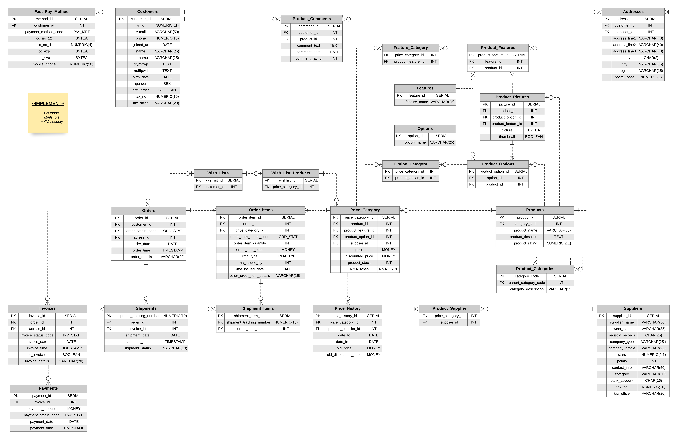
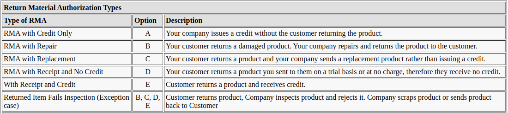

\

> _This project is based on recreating a reliable, robost and secure object-relational database for an e-commerce website facilitating online transactions of goods mainly based on Business-to-Consumer (B2C) model._

\

**Keywords:** _E-Commerce, Electronic Funds Transfer, Online Marketing, Supply Chain Management, Inventory Management Systems, Online Transaction Processing, Electronic Data Interchange._




# Features

+ Having reference relations for particular attributes, provides less usage of storage which is obtained by encoding varying characters to a single digit. As well as satisfying some normal form criterions.

+ Addresses relation is designed considering the fact that a customer may have more than one address or may want to have their invoice sent to a different address. In addition to that suppliers' addresses are also stored in this table so that all addresses are unified.
 
+ A product can be acquired from many suppliers resulting that it may have various prices. _Product Suppliers_ table is forming a bridge between _Product_ and _Suppliers_ relations.
 
+ _Order Items_ table provides the necessary conditions for customers to have more than one item in their orders.
 
+ _Invoices_ relation is created due to the fact that a customer do have the freedom of having numerous orders from distinct suppliers, resulting several invoices deriving from a single order. Same reasoning implies for the seperation of _Shipment_ relation's attributes from _Orders_.

+ Product images are not presented by suppliers to overcome the duplication of images in our database

# Logical Integrity

+ **Referential Integrity** is enforced by defining necessary _on update_ and _on delete_ properties on declared foreign keys.

+ **Entity Integrity**, all relations are equipped with a primary key.

+ **Check Constraints**, necessary attributes have their constraints defined.

+ **Self Referential Data** is featured in _Product Category References_ relation in order to allow child categories to exist within parent categories. 

# Data Types
 
- **Serial** data type can handle $2^{32}$ representations equipped with auto increment feature.

- Sensitive information required for fast payment methods are stored in **bytea** format which is unique to PostgreSQL. Symmetric encryption via AES is yet not implemented to the project. This data type has additional 1 or 4 bytes before the actual binary string. Same data type is also used for storing product pictures.
 
- **Md5** hash function is implemented to store user passwords for short login times and necessary security.

## Defined Data Types

```
Create types
CREATE TYPE sex AS ENUM ('M', 'F', 'O');             -- Male, Female, Others
CREATE TYPE ord_met AS ENUM ('CC','DC');             -- Credit Card, Debit Card
CREATE TYPE inv_stat AS ENUM ('A','S','C','R');      -- Awaiting, Shipped, Cancelled, Rewised
CREATE TYPE ship_stat AS ENUM ('A','P','T','D','R'); -- Awaiting, Processing, in Transit, Delivered, Returned
CREATE TYPE pay_stat AS ENUM ('P','S','C','R');      -- Pending Success Cancelled Rejected
CREATE TYPE ord_stat AS ENUM ('AP','OH','OR','OP','AS','S','D','C','R'); -- Awaiting Payment, On Hold, Order Received, Order Packed, Awaiting Shipment, Shipped, Delivered, Cancelled, Refunded
CREATE TYPE rma_type AS ENUM ('A','B','C','D','E','BCDE');
```
 
- **Rma_type** is created for _Return Merchandise Authorization_ policies, defining 6 different ways of returning a product to receive a refund, replacement, or repair during the product's warranty period. Both parties can issue a return process.



# Normal Form

Third normal form (3NF) is attained on every single table by the following assets:

+ Non of the tables have duplicates.
 
+ Repetition of groups is avoided.
 
+ Each cell has one and only one value.
 
+ There are no partial dependencies.
 
+ Values depend only on candidate keys.

# Deployment

Database is running on a remote PostgreSQL server deployed on a virtual private server powered by GNU/Linux CentOS 7, communication with the server is either held by https connection or ssh tunneling.
